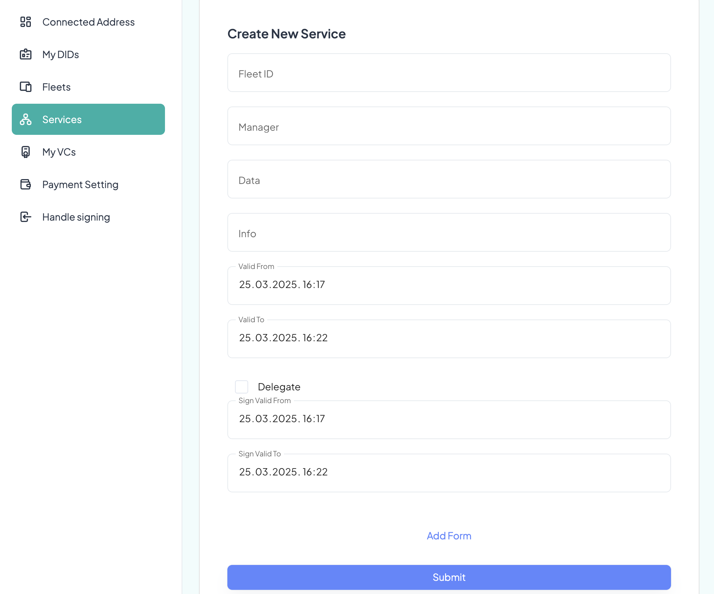
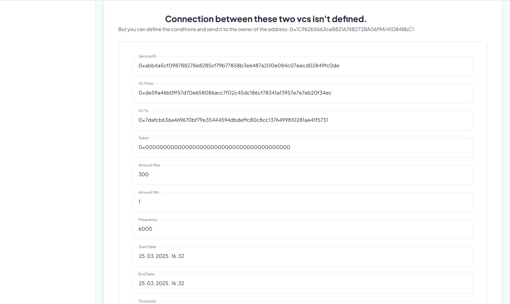

# 🛠 IOTPAY Dashboard – Full Guide

## Table of Contents
- [Getting Started Locally](#getting-started-locally)
- [Authentication](#step-1-authentication)
- [Dashboard Layout](#step-2-dashboard-layout-overview)
- [Address Management](#step-3-managing-addresses-and-activity)
- [DID Management](#step-4-managing-dids-decentralized-identifiers)
- [Fleet Management](#step-5-managing-fleets)
- [Service Management](#step-6-managing-services)
- [VC Management](#step-7-managing-verifiable-credentials-vcs)
- [Payment Configuration](#step-8-configuring-payments-between-vcs)
- [Handle signing and payment](#step-9-manual-signing-and-payments-debugtest-tools)
- [Glossary](#glossary)
- [Best Practices](#best-practices)
- [Security Considerations](#security-considerations)

## Getting Started Locally

<details>
  <summary> Getting Started Locally </summary>

#### To run the project locally, make sure you have the following tools installed on your system:

Prerequisites:
	
-   **Node.js v18**: You can download it from the official Node.js website.

-	**Docker**: Make sure Docker is installed and running. You can get it here.

-	**MetaMask** browser extension: Required to interact with the app using a Web3 wallet. Install it from the MetaMask website.

- **Angular** CLI v17.0.1: This project was generated using Angular CLI.


# Project Setup

Follow these steps to set up and run all parts of the system locally:


## 1. Backend (Server)

Clone and run the backend server:

```bash
git clone https://github.com/Werenode/IOTPAY_server
cd IOTPAY_server
npm install
npm run docker_start   # Starts required Docker services
npm run start          # Starts the backend server
```

## 2. Dashboard (Frontend)

In a new terminal window, clone and run the dashboard interface:

```bash
git clone https://github.com/Werenode/dashboard_for_iotpay
cd dashboard_for_iotpay
npm install
npm run start
```

This will launch the Angular-based dashboard in development mode. By default, it should be available at http://localhost:4200.


## 3. Simulated Client (MQTT Device)

To simulate a connected IoT device over MQTT:

```bash
git clone https://github.com/Werenode/IOTPAY_client_mqtt
cd IOTPAY_client_mqtt
npm install
npm run start
```

This will start a client that communicates with the backend via MQTT protocol.

</details>


___

# 🛠 IOTPAY Dashboard – Full Guide

The Dashboard provides a visual interface to manage fleets, services, and IoT devices through your Web3 wallet. Below is a step-by-step guide to configure and operate your system.

### About the "Delegated" Option in Forms

Across most forms in the Dashboard, you'll notice a checkbox labeled "Delegated".
This option determines how a transaction will be sent to the blockchain:

___

If "Delegated" is not checked:

-	The transaction will be sent directly from your wallet using MetaMask.

-	You will see a MetaMask popup requesting you to confirm and broadcast the transaction.

-	You'll need to pay the gas fees yourself.

___

If "Delegated" is checked:

-	You will sign the transaction data using your wallet, but you won't send it yourself.

-	The dashboard will have fields for how long your signature should remain valid (default is 5 minutes).

-	The server will send the transaction on your behalf during that time.


**Note**: The smart contract will verify your signature to ensure you authorized the action.

___

This delegated mechanism is particularly useful for devices or low-resource environments where MetaMask is unavailable — or for advanced workflows involving backend coordination.


## Step 1: Authentication

To access and use the Dashboard, you first need to authenticate using MetaMask and your platform credentials.


### Install MetaMask

If MetaMask is not detected, you'll see a prompt to install it.
Download it from the official website and add it to your browser.


### Create an Account

Once MetaMask is installed and set up:
-	Enter your email and password to create an account on the platform.
-	This step links your MetaMask wallet to your platform account.

Make sure your wallet is unlocked in MetaMask.


### Login

If you already have an account:
-	Enter your email and password in the login form.
-	MetaMask will automatically request permission to connect to the site — this is expected and required for secure interaction.

After successful login, you'll be redirected to the main dashboard interface.


# Step 2: Dashboard Layout Overview

After logging in, you'll arrive at the main dashboard screen. Here's what you'll see:

### Sidebar Menu (Left Side)

On the left side of the screen, you'll find the main navigation menu.
It gives you access to all key sections of the system, such as:
  -	Fleets
	-	Services
	-	Devices
	-	Verifiable Credentials (VCs)


At the top, there are two key icons:
	
1.	**Notifications Icon** - Displays system notifications related to transaction events.

2.	**Account Icon** - Shows:

- The first few characters of your connected wallet address.

-	The display name stored in the platform database (or undefined if this address hasn't been used yet).

Clicking the account icon opens a dropdown with a Logout button, allowing you to safely disconnect from the platform.

# Step 3: Managing Addresses and Activity

**Table 1 – Your Addresses**

This table displays all the addresses you operate with, including:

-	Your connected wallet address
-	Any external addresses you've manually added via the form below (e.g., IoT devices)

These addresses are pulled from your wallet and the platform database.


**Table 2 – Recent Transactions**

When you select an address in Table 1, this table shows the latest 9 transactions associated with it.

This gives you a quick view of recent activity such as:

-	Credential operations
-	Device interactions
-	Payment events


**Form 1 – Add or Edit External Addresses**

Use this form to add external addresses (e.g., your devices) that you want to track or manage.

You'll be asked to enter:
-	The address
-	A custom label/name for easier identification

You can also use this form to edit the label of an already-added address by re-submitting it with a new name.


# Step 4: Managing DIDs (Decentralized Identifiers)

This section of the Dashboard is dedicated to viewing and creating DIDs on the platform — primarily for devices.

**Address Cards**

At the top of the page, you'll see a list of address cards, based on the addresses from Table 1 (see previous section).
Each card shows:

-	The custom label (name) of the address
-	Whether the address already has a DID
-	The current ETH balance (token support will be added later)

These cards provide a quick overview of your registered entities.


**DID Creation Form**

Below the cards is a form for manual DID creation. Although DIDs are usually created automatically by the device software, this form is included in the Dashboard for flexibility and testing.

To create a new DID, fill in the following fields:

-	Address – the address that will be associated with the DID
-	Verification Method(s) (optional) – one or more addresses that can act on behalf of the DID (e.g., managers or service providers)
-	Information (optional) – any additional data or metadata you want to attach to the DID for identification or proof purposes.

📌 Note:
DIDs are only required for devices, not users. But the dashboard allows manual DID management in case automation fails or needs debugging.


**Editing or Deleting a DID**

When you click on an address card, a dialog window will appear, allowing you to manage the associated DID.

From this dialog, you can:
-	Edit the verification method(s) – add or remove addresses authorized to act on behalf of the DID
-	Update the DID information – change or enrich metadata tied to the DID
-	Delete the DID – remove it entirely from the system

How it works:
- If you re-enter the same verification methods or info that are already associated — they will be removed.
-	If you enter new data — it will be added to the DID document.

 In production, these operations are expected to be handled automatically by the device firmware. The dashboard provides this manual control only as a fallback or for debugging/testing purposes.


# Step 5: Managing Fleets


The Fleets tab allows you to create and manage groups of devices and services under a common structure. Each fleet has an owner, metadata, and a validity period.


## Create New Fleet

At the top of the page, you'll see a "Create Fleet" button that opens a form.

To create a new fleet, fill out the following fields:

-	Owner Address – the address that will be the fleet's administrator
-	Fleet Name – a label to help you identify the fleet
-	Data – optional information explaining the fleet's purpose or use case (also used to help generate a unique fleet identifier)
-	Start & End Dates – the validity period of the fleet (e.g., when the fleet becomes active and when it expires)

You can choose to send the transaction directly or delegated


## Fleet Cards

Below the creation form, you'll see cards for each fleet that your account manages. Each card displays:

-	The Fleet Name
-	Its Unique Fleet ID
-	The Owner's Address
-	The Status (e.g., active, expired, or pending)

These cards offer a quick overview of your organizational structure

## Viewing Fleet Details


Clicking on any fleet card opens a detailed view with additional options and insights.

**Fleet Info Panel**

The panel shows all essential information about the selected fleet, along with several action buttons:

-	View Services – navigates to a page listing all services created within this fleet

-	Delete Fleet – opens a confirmation dialog to permanently remove the fleet from the system


**Transaction Table**

Below the action buttons, you'll see a table that lists all relevant transactions related to this fleet, including:
-	Verifiable Credential (VC) creation and updates
-	Service additions or removals
-	Any actions tied to devices or addresses linked to the fleet

This gives you a transparent view of all blockchain-level activity within the fleet.


# Step 6: Managing Services

The Services tab lets you create and manage service units within your fleets. Each service belongs to a fleet and is managed by a designated address.


## Create New Service

At the top of the page, click the "Create Service" button to open the creation form.

To register a new service, fill out the following fields:

-	Fleet ID – the unique identifier of the fleet this service will belong to

-	Manager Address – the address that will control and operate the service

-	Data – optional metadata describing or verifying the purpose of the service

-	Info – the service name or label that will appear in the UI

-	Start & End Dates – the time range during which the service will be considered active

As with fleets, you can choose to submit this transaction directly or via delegated signature.




## Service Cards

Below the form, the Dashboard displays cards for all services your account manages. Each card shows:

- Service Name (info field)
-	Service ID (a unique identifier)
-	Manager Address
-	Status (active, expired, etc.)

## Viewing Service Details

Clicking on a service card opens a detailed info panel:

-	It shows all metadata and status details
-	Includes the buttons to view VCs (Verifiable Credentials) created under this service
-	Provides a Delete Service button, opening a confirmation dialog


# Step 7: Managing Verifiable Credentials (VCs)

The VC tab provides a complete overview of all Verifiable Credentials registered on the platform, along with visual insights into their interactions.


## VC Cards

At the top of the page, you'll see cards for all VCs currently on the platform.

Each VC card displays:

-	The name of the VC
-	Its description
-	The associated service
-	The VC's unique identifier
-	The DID address it is linked to

⚠️ Note: When a device creates a new VC, it will initially appear in the pending state, awaiting confirmation from the service manager. (This functionality will be available starting March 26th.)

## VC Graph Visualization

Below the cards is an interactive graph of your VCs.

-	Each node represents a VC.
-	An edge (connection) between two VCs means that they are interacting or involved in payments with each other.

This view helps you understand relationships and dependencies between devices/services at a glance.

## Viewing and Managing a VC

Clicking on a VC card opens a detailed panel where you can:
-	Edit the name or description of the VC
-	Delete the VC
- View a transaction/event table, listing all on-chain actions related to this VC's identifier

This allows full lifecycle management of VCs directly through the Dashboard.


# Step 8: Configuring Payments Between VCs

The Payments tab allows you to set up automated payments between two Verifiable Credentials (VCs) from different services. The configuration process ensures that both managers agree on the terms before payments begin.


## Two-Step Setup Process

Payment setup is split into two phases to ensure security and mutual agreement:

1.	Step 1 – Initiated by managerFrom (manager of the service sending payments): This user defines the full set of payment terms and signs the configuration.
	
2.	Step 2 – Completed by managerTo (manager of the service receiving payments): This user reviews the configuration and, if everything is correct, submits the transaction on-chain.


## Payment Details Form (managerFrom)


On the main screen, start by entering the two VC IDs involved in the payment.

If you're logged in as the managerFrom, you'll see a form with the following fields:

| Field | Description |
|-------|-------------|
|VC From / VC To / Service ID| Pre-filled identifiers of involved entities|
|Token Address| Address of the payment token (use 0x000...000 for native token like ETH)|
|Amount Min / Max|Lower and upper bounds for each payment|
|Frequency|How often payments occur (in seconds)|
|Start Date / End Date|Time range during which the setup is valid|
|Threshold | Number of approvals required before payment can be made (for |multi-sign validation)|
|Status| Default is 2 (NOTE: status meaning will be expanded soon)|
|RTN Validity| How long a signed payment code is considered valid (in seconds)
|Sign Valid From / To| Signature validity window, defining when the signed terms can be used|




Once filled and signed, this form generates a JSON object that the receiving side (managerTo) will use.

## Payment Confirmation (managerTo)

If you're logged in as the managerTo, you'll see a form that allows you to paste the signed JSON from managerFrom.

- The form will automatically populate with the received values.
- You can verify and confirm the data.
-	If everything looks good, submit the transaction to finalize the agreement.


## Existing Payment Configurations

If a payment configuration between the selected VCs already exists, the dashboard will show:

-	All previously submitted payment terms

-	The current fee (by default 0.01, deducted by the platform per transaction)


## Managing Validators (Whitelist Management)

After you will see an additional option to manage validator addresses.

Clicking the "Update WhiteList button opens a form that allows you to whitelist or remove validators involved in the approval process.

The form contains:
-	Pre-filled fields:
-	VCFrom
-	VCTo
-	ServiceFrom

These identify the payment configuration to which validators are being assigned.

Whitelist Entries:
-	Address – the wallet address to be added or removed
- Whitelist Value – set to:
	-	true to grant validator rights
	- false to revoke those rights

You can add multiple addresses in a single action, enabling flexible control over who can approve payments.


## Payment Transaction History

At the bottom of the page, you'll find a table listing all payment transactions associated with this setup.

The payment key is defined by the unique triplet: (serviceFrom, VCFrom, VCTo)


# Step 9: Manual Signing and Payments (Debug/Test Tools)

This section is primarily intended for testing and debugging purposes, especially when working with embedded wallets on devices. It provides manual access to actions that are normally handled automatically in production environments.

Available Actions

On this page, you will find three buttons, each opening a specific form corresponding to one step of the payment process:


## Sign Code

This form mimics the device-to-device signature process and is usually not needed through the UI in production.

-	Used by: Device with VCTo
-	Purpose: Confirms a code received from the VCFrom device for payment verification.

Required fields:
-	VCFrom – the sender VC
-	VCTo – the receiver VC (this device signs the code)
-	Service ID
-	Code – a one-time authorization code generated by the sender

After submission, this creates a signed code (RTN) that will be used in the following steps.


## Validate Payment

Used when the payment setup includes a threshold > 0, meaning multi-signature validation is required before funds can be transferred.

-	Used by: A validator address listed in the Whitelist
-	Purpose: Approves a signed RTN (from the previous step)

Required fields:
-	VCFrom
-	VCTo
-	Service ID
-	RTN – the signed code generated in step 1

⚠️ Make sure this address is included in the Whitelist and that the payment setup is active and valid.


## Make Payment

This is the final step, where payment is actually executed.

-	Used by: The device or account controlling VCFrom
-	Purpose: Sends funds according to the RTN and payment configuration

Required fields:
-	VCFrom
-	VCTo
-	Service ID
-	RTN – the signed and validated code
-	Amount – the amount to be paid

Once submitted, the transaction will be sent to the blockchain, and the payment will be completed (assuming all prior steps are valid).


# Glossary

## Core Terms
- **DID (Decentralized Identifier)**: A unique identifier that enables verifiable, self-sovereign digital identity
- **VC (Verifiable Credential)**: A tamper-evident credential that has been cryptographically signed
- **Fleet**: A group of devices and services managed under a common structure
- **Service**: A unit within a fleet that manages specific functionalities
- **RTN (Request Token Number)**: A one-time authorization code for payment verification

## Technical Terms
- **Gas Fee**: The cost required to perform a transaction on the blockchain
- **Delegated Transaction**: A transaction signed by the user but executed by the server
- **Multi-signature**: A security feature requiring multiple approvals for a transaction
- **Validator**: An address authorized to approve transactions of payments
- **Whitelist**: A list of approved addresses for specific operations


## Support
For additional support:
- Check the [GitHub Issues](https://github.com/Werenode/dashboard_for_iotpay/issues)
- Contact zhenyazhdarkin@gmail.com


